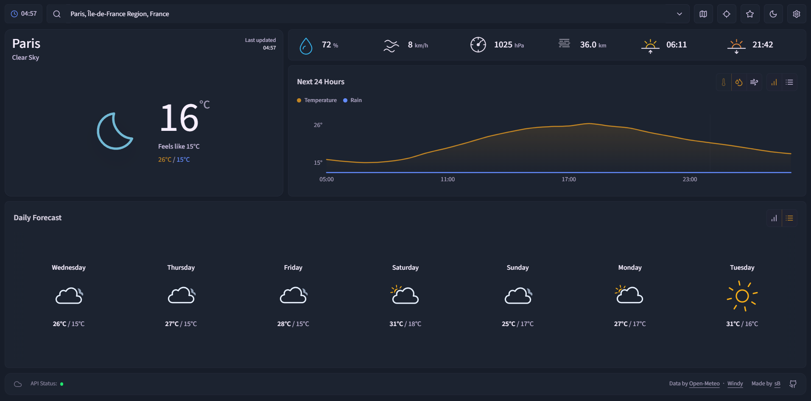

# Weather



A responsive weather dashboard built with React and Vite. Search for a place or use your device location to see current conditions, detailed forecasts, and a local precipitation radar.

## What it does

- Shows current temperature, feels-like temperature, daily high/low, humidity, wind, pressure, visibility, sunrise, and sunset.
- Provides a 24-hour hourly forecast and a 14-day daily forecast, each available as a chart or a compact list.
- Searches Open-Meteo locations with keyboard-friendly suggestions and lets you save favorite places.
- Includes an embedded Windy precipitation radar centered on the selected location.
- Supports English and French, metric and imperial units, light and dark themes, and three weather-icon styles.
- Persists display preferences, the active view, theme, favorite locations, and the last selected location in the browser.

## Data and services

- [Open-Meteo](https://open-meteo.com/) for weather forecasts and place search
- [BigDataCloud](https://www.bigdatacloud.com/) for reverse geocoding the device location
- [Windy](https://www.windy.com/) for the embedded radar map
- [Capacitor Geolocation](https://capacitorjs.com/docs/apis/geolocation) when running as a native app, with the browser Geolocation API on the web

## Stack

- React 19, TypeScript, and Vite
- Tailwind CSS 4 and Radix UI primitives
- Recharts for forecast charts
- Source Sans 3 for a clear, compact interface typography

## Run locally

```sh
npm install
npm run dev
```

Vite prints the local URL when it starts (usually `http://localhost:5173`). No environment variables are required.

## Other commands

```sh
npm run build    # Type-check and create a production build
npm run lint     # Check source files with ESLint
npm run preview  # Serve the production build locally
```

## Notes

Weather, geocoding, radar, and the web font are external services. The app displays a clear retryable error state when a weather or location request cannot complete. Browser location access requires the visitor’s permission.
